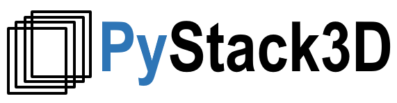

# Introduction

**PyStack3D** is a package dedicated to images correction intended -for instance- to FIB-SEM stack images postprocessing before image segmentation.

The ``pystack3d`` workflow includes the following process steps which can be activated or not and executed in any order:

- ``cropping`` to reduce the image to the ROI (Region Of Interest)

- ``background removal`` (named "bkg_removal") to reduce artefacts issued for instance from shadowing, charging, ...

- ``intensity rescaling`` (named "intensity_rescaling") to homogoneize the 'gray' intensity distribution between successive frames

- ``registration`` (decomposed in "registration_calculation" and "registration_transformation"), to correct images misalignment due to shifting, drift, rotation, ... during the images acquisition

- ``destriping`` to minimize artefacts like stripes that can appear in some image acquisition technics

- ``resampling`` to correct non uniform spatial steps

An additional step named `cropping_final` can be used to eliminate artefacts produced near the edges during the image processing or to select another ROI at the end.

      
    <em>Illustration of a <b>PyStack3D</b> workflow applied on a FIB-SEM image and using some of the process steps.</em>

