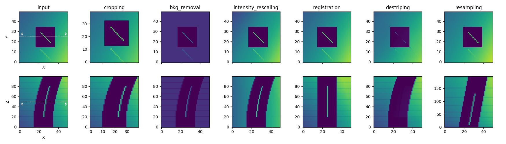

# Introduction

**PyStack3D** is a package dedicated to "correct" stacks of images before realizing segmentation for instance.

The ``pystack3d`` workflow consists of the following process steps which can be activated or not and executed in any order:

- ``cropping``: to reduce the image to the ROI (Region Of Interest)

- ``background removal``: to reduce the shadowing effects on images

- ``intensity rescaling``: to homogoneize the 'gray' intensity distribution between successive images

- ``registration``: to correct images misalignment (shift, drift, rotation, ...)

- ``destriping``: to eliminate/reduce artefacts like stripes that can appear in some image acquisition technics

- ``resampling``: to correct non uniform spatial step during the acquisition

totototo

totototo
