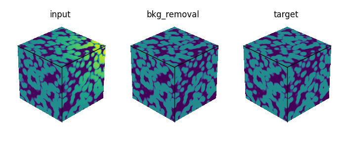
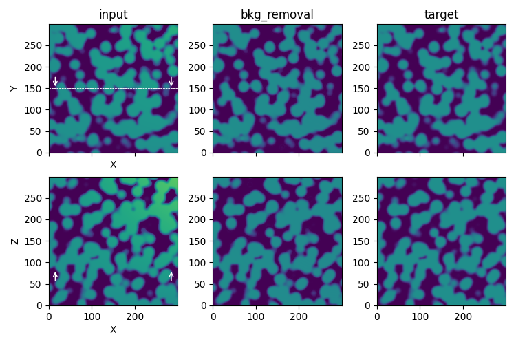
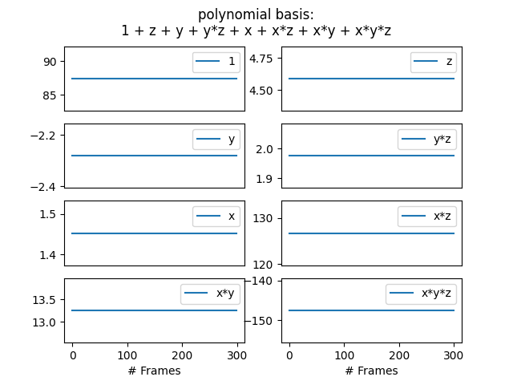
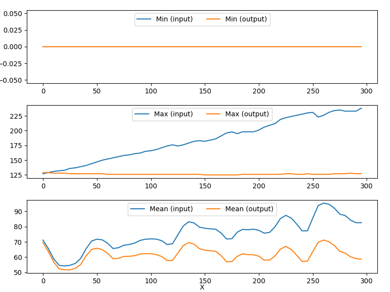
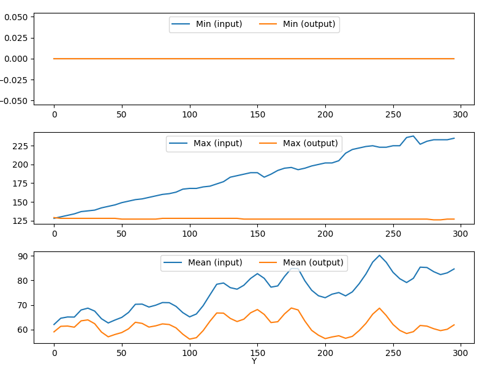

Background removal
==================

Most of the stacks acquisition techniques can produce gray intensity variations due, for instance, to **charging** effects (on low conductive material) or to **shadowing** effects (when imaging an area deep inside the material).

The **background removal** process step aims at reducing these **large-scale** effects on the images, assuming a polynomial behaviour to be fitted and removed.

.. note::

    This fit is realised through the resolution of a minimization problem with a least square algorithm that consists in 2D to:

    *Given a polynomial basis* :math:`[1, x, y, xy, x^2, ...]`, *find the polynom coefficients* :math:`(a_0, a_1, a_2, a_3, a_4,...)` *such as:*

    .. math::

         \begin{aligned}{\underset {(x, y)\in \mathbb {RxR} \subset Img}{\operatorname {minimize} }}\quad &\|Img(x, y) - a_0.1 + a_1.x + a_2.y + a_3.xy + a_4.x^2 + ...\|^{2}\end{aligned}

    Illustration of the **bkg_removal** process step in the `synthetic test case <https://github.com/CEA-MetroCarac/pystack3d/blob/main/examples/ex_synthetic_stack.py>`_.

::

    [bkg_removal]
    dim = 3
    #poly_basis = "1 + x*y*z"
    orders = [1, 1, 1]
    cross_terms = true
    skip_factors = [5, 5, 5]
    threshold_min = 5
    #threshold_max = 10.
    #weight_func = "HuberT"
    #preserve_avg = true

The ``dim`` parameter defines the dimension of the problem to solve (2D or 3D):

* with  ``dim = 3`` a single resolution is performed (with a potentially high CPU cost) on the entire stack to determine the polynom coefficients. *(The cost resolution can be significantly decreased using the* ``skip_factor`` *parameter, see below).*

* with  ``dim = 2`` the resolution is performed slice by slice, leading to different polynom coefficients from one slice to another.

The 2D or 3D polynomial basis used to perform the fit can be defined in two ways:

* from ``poly_basis`` which defines the polynomial basis definition **explicitly**, term by term, from a literal expression

* from ``orders`` and ``cross_terms`` which define the basis **implicitly** in function to the order associated to each variable (x, y) in 2D or (x, y, z) in 3D.

.. warning::
    Taking into account **cross terms** in the definition of the polynomial basis can prove crucial for achieving the desired fit. For instance, a background thought to be in the form of 'xyz' may actually have its minimum following a definition in '(x-a)(y-b)(z-c)' in the reference basis used by the minimization procedure.

Since the images sizes and the number of frames could be big, the ``skip_factors`` parameter allows to significantly reduced the array to consider in the fitting processing.
*(Setting a skip_factors = [10, 10, 10] on a stack of size ~1000x1000x1000 seems to be a good compromise between accuracy, RAM occupancy and time execution).*

When a skip factor is applied, the values taken into account are the ones corresponding to the indices positions. Using ``skip_averaging = true`` realizes a local averaging instead. *(Note that no real benefit has been observed practically when activating this averaging).*

Images may include regions that are not impacted (or slightly impacted) by the background effects like holes in a porous medium (characterized by very low values) or saturated pixels (characterized by very high values).
For this reason, a mask to exclude values below ``threshold_min`` and above ``threshold_max`` can be defined to be applied during the fit processing.

The ``weight_func`` parameter ("**HuberT**", "**Hampel**" or "**None**") enables to specify (or not) a weight function used to determine and exclude outliers during the least squares problem resolution.
See  the `RLM documentation <https://www.statsmodels.org/stable/rlm.html>`_ for more details.
(Default value is "HuberT").

At last, the ``preserve_avg`` parameter enables to preserve the average between the input and the output data. The average preservation is suitable only when ``dim = 3``.
(Default value is False).

Plotting
--------

The special plotting related to the **bkg_removal** process step generates images in the dedicated **outputs**  folder that are named **coefs.png**, **stats_X.png** and **stats_Y.png**.

    **coefs.png** gives the polynomial basis coefficients.

    **stats_X.png** displays statistics along the 'X' axis.

    **stats_Y.png** displays statistics along the 'Y' axis.