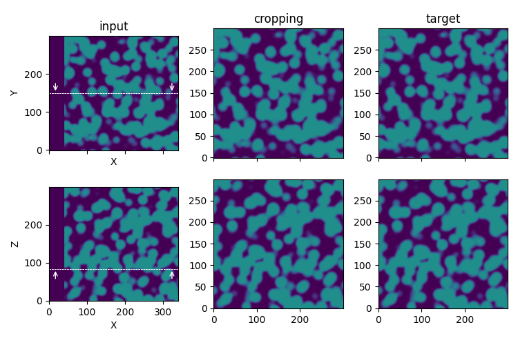

Cropping
--------

Most of the time, the images stack acquisition area is wider than the Region Of Interest (ROI). **Cropping** is then dedicated to "crop" the images in the ROI.

    Illustration of the **cropping** process step in the `synthetic test case <https://github.com/CEA-MetroCarac/pystack3d/blob/main/pystack3d/examples/ex_pystack3d_synth.py>`_.

::

    [cropping]
    area = [5, 45, 2, 42]

``area`` indicates the [xmin, xmax, ymin, ymax] coordinates (in pixel) of the image to crop in the standard coordinates system (with the origin located in the bottom left)

