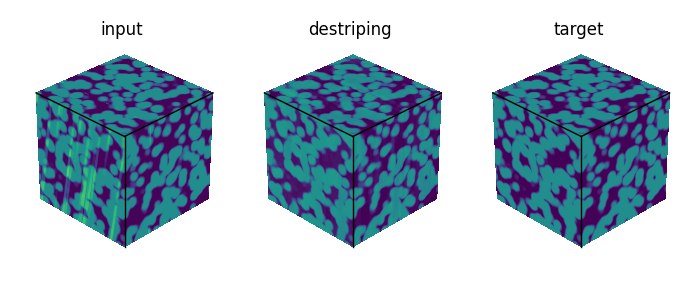
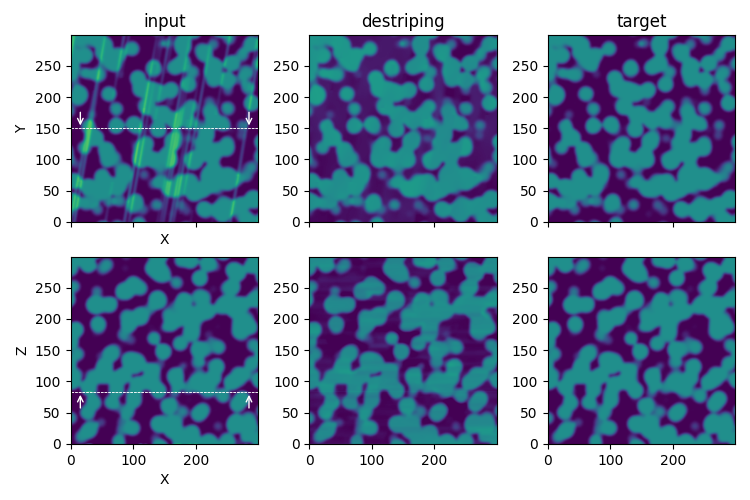

Destriping
==========

The destriping process step aims at minimizing artefacts like stripes or curtaining effects that can appear in some image acquisition technics.

The algorithm used for the destriping is issued from the `pyvnsr <https://github.com/CEA-MetroCarac/pyvsnr>`_ library.

    Illustration of the **destriping** process step in the `synthetic test case <https://github.com/CEA-MetroCarac/pystack3d/blob/main/examples/ex_synthetic_stack.py>`_.

::

    [destriping]
    maxit = 50
    cvg_threshold = 1e-2
    filters = [{ name = "Gabor", noise_level = 200, sigma = [2, 80], theta = 10 }]

``maxit`` refers to the number of iterations used by the `pyvnsr <https://github.com/CEA-MetroCarac/pyvsnr>`_ algorithm.

``cvg_threshold`` is a convergence criterion that can be used to stop the iterative `pyvnsr <https://github.com/CEA-MetroCarac/pyvsnr>`_  process when the maximum residual variation between 2 iterations has reach this value.

``filters`` consists of a list of filters to be used during the destriping process and are related to the shape and intensity of the stripes to be removed.

For each of these parameters, see the `pyvnsr <https://github.com/CEA-MetroCarac/pyvsnr>`_ documentation for more details.
