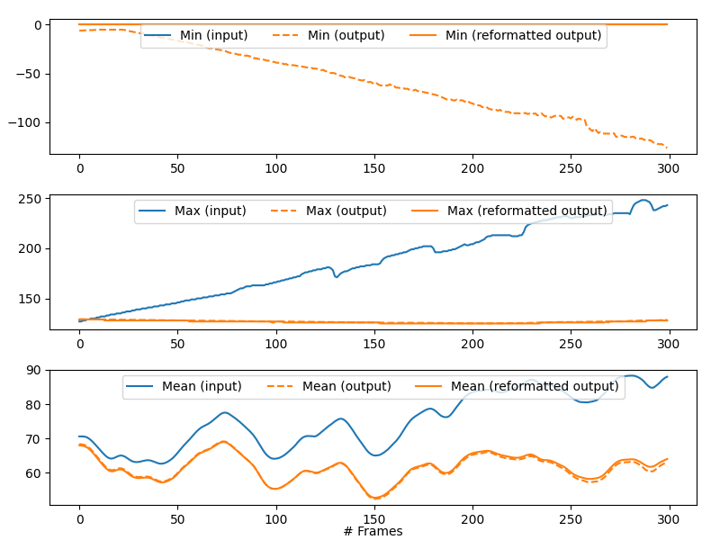

Getting started
===============

Project directory organization
------------------------------

To be executed, a **PyStack3D** workflow requires both:

* a ``params.toml`` file defining all the process steps parameters (see the `parameters settings <file:///C:/Users/PQ177701/PycharmProjects/pystack3d/doc/_build/html/params.html>`_ section)

* a **project directory** including the ``.tif`` images named with their respective **slice numbers** and their **z-positions** either in the root directory:

::

    project_dir
        |-- params.toml
        |-- slice_0000_z=0.0000um.tif
        |-- slice_0001_z=0.0100um.tif
        |   ...

or in sub-folders for a multi-channels acquisition::

    project_dir
        |-- params.toml
        |-- channel_1
        |       |-- slice_0000_z=0.0000um.tif
        |       |-- slice_0001_z=0.0100um.tif
        |           ...
        |-- channel_2
        |       |-- slice_0000_z=0.0000um.tif
        |       |-- slice_0001_z=0.0100um.tif
        |           ...

Once executed, the **outputs** directories related to each process step can be found inside the ``process`` directory as follows::

    project_dir
        |-- params.toml
        |-- slice_0000_z=0.0000um.tif
        |-- slice_0001_z=0.0100um.tif
        |   ...
        |-- process
        |       |-- cropping
        |       |       |-- outputs
        |       |       |-- slice_0000_z=0.0000um.tif
        |       |       |-- slice_0001_z=0.0100um.tif
        |       |           ...
        |       |-- bkg_removal
        |       |       |-- outputs
        |       |       |-- slice_0000_z=0.0000um.tif
        |       |       |-- slice_0001_z=0.0100um.tif
        |       |           ...
        |        ...

or for a multi-channels acquisition::

    project_dir
        |-- params.toml
        |-- channel_1
        |       |-- slice_0000_z=0.0000um.tif
        |       |-- slice_0001_z=0.0100um.tif
        |           ...
        |-- channel_2
        |       |-- slice_0000_z=0.0000um.tif
        |       |-- slice_0001_z=0.0100um.tif
        |           ...
        |-- process
        |       |-- cropping
        |       |       |-- outputs
        |       |       |-- channel_1
        |       |       |       |-- slice_0000_z=0.0000um.tif
        |       |       |       |-- slice_0001_z=0.0100um.tif
        |       |       |       |   ...
        |       |       |-- channel_2
        |       |       |       |-- slice_0000_z=0.0000um.tif
        |       |       |       |-- slice_0001_z=0.0100um.tif
        |       |       |       |   ...
        |       |-- bkg_removal
        |       |       |-- outputs
        |       |       |-- channel_1
        |       |       |       |-- slice_0000_z=0.0000um.tif
        |       |       |       |-- slice_0001_z=0.0100um.tif
        |       |       |       |   ...
        |       |       |-- channel_2
        |       |       |       |-- slice_0000_z=0.0000um.tif
        |       |       |       |-- slice_0001_z=0.0100um.tif
        |       |       |       |   ...
        |        ...

*(The content of each 'outputs' directory is detailed below)*

.. warning::

    As illustrated above, following each process, images of the entire processed stack are saved. Consequently, this requires having a sufficient amount of free disk space.

    For instance, in the case of a stack of 2000 images sized 2000x2000 encoded in 16 bits, each process step will require storing approximately 15GB of data.

    To facilitate the cleaning of these large volumes of data, a ``cleanup()`` function was created (see the **Workflow execution** section below).

Workflow initialization
-----------------------

All the workflow instructions are provided in a ``params.toml``.

A **raw** ``params.toml`` is given `here <https://github.com/CEA-MetroCarac/pystack3d/blob/main/assets/toml/params.toml>`_ (to be adapted according to needs).

Case of a Zeiss FIB-SEM
~~~~~~~~~~~~~~~~~~~~~~~

In the case of **Zeiss** FIB-SEM acquisitions, some **metadata** produced by the software for 3D acquisition (Atlas, developped by Fibics) can be automatically extracted from the .tif image files and the ``Atlas3D.a3d-setup`` file. Based on these, the default parameters for the processing can be adapted as follows::

   from pystack3d.utils_metadata_fibics import params_from_metadata

   params_from_metadata(project_dir, save=True)

where ``project_dir`` refers to the project directory pathname containing the ``Atlas3D.a3d-setup`` file (mandatory file), and the .tif files in sub-directories corresponding to different channels (at least one slice in the first channel directory is required).
This will save a ``params_from_metadata.toml`` file based on the **raw** one but adapting some of the parameters to the acquisiton with the help of the extracted metadata.
The affected parameters are listed here:

- Name of the **channels** is read in the ``Atlas3D.a3d-setup`` file.

- For the cropping step, **area** is defined based on the ROI of the first slice and will not take into account changes of ROI that might have been made during the acquisition.

- For the resampling step, **dz** is read in the ``Atlas3D.a3d-setup`` file

On top of that, the function checks that the first slice is square and that the field of view of the ``Atlas3D.a3d-setup`` file corresponds to the first slice size.

By default, the reference ``params.toml`` file used by :code:`params_from_metadata` for all the other parameters is the **raw** one. But the user can provide another reference .toml file through the ``fname_toml_ref`` argument::

   params_from_metadata(project_dir, save=True, fname_toml_ref=my_toml_ref)

Workflow execution
------------------

A **PyStack3D** workflow execution is obtained with the following instructions::

    from pystack3d import Stack3d

    stack = Stack3d(input_name)
    stack.eval(process_steps, nproc=16)

``input_name`` corresponds either to the **project directory pathname** or to the ``params.toml`` in which the project directory pathname has to be defined via the ``input_dirname`` parameter.

``process_steps`` refers either to a single process step or to a list of process steps or can be omitted leading to the execution of the full process steps defined in the ``params.toml`::

    # execute only the 'cropping' process step
    stack.eval(process_steps="cropping", nproc=16)

    # execute the 'cropping' and the 'background removal' process steps
    stack.eval(process_steps=["cropping", "bkg_removal"], nproc=16)

    # execute all the process steps defined in the 'params.toml' file
    stack.eval(nproc=16)

``nproc`` corresponds to the number of threads to use for the workflow execution.

Note that an additional boolean keyword named ``serial`` allows to realize non-serialized calculations when setting to ``False`` (said differently, with ``serial = False`` the workflow is executed using the original raw input data for each process step).

At the end of a workflow execution, a cleaning up of all the .tif files (except the ones related to the last ``process_steps``) can be done easily as follows::

    stack.cleanup()

At least, to ease the full 3D-stack visualization, .tif files can be concatenated in a single one. See :class:`~pystack3d.Stack3d.concatenate_tif` for more details::

    stack.concatenate_tif() # tif files concatenation related to the last process_step
    stack.concatenate_tif('input') # tif files concatenation related to the input data

Outputs
-------

Each process steps returns **specific** and **standard** outputs (data and figures) in the related process step **outputs** directory.

**Specific** outputs are related to each process steps. They are described in each of the process steps sections hereafter (if existing).

**Standard** outputs consist in the statistics (min, max, mean) on gray values evolution along the stack axis (z-axis, by convention) **before** and **after** the process step execution. For the 'after' values, the statistics without and with data reformatting compatible with the input data format are plotted. Indeed, some process steps may modify the data type (typically from integer to float) and/or generate data outside the range of authorized data values. *(This could happen for instance in the* **bkg_removal** *process step when subtracting the background that could generate negative or positive overflowed values)*.

    Example of statistics returned by the **bkg_removal** process step in the `synthetic test case <https://github.com/CEA-MetroCarac/pystack3d/blob/main/examples/ex_synthetic_stack.py>`_.

Examples
--------

Two examples are provided with the pystack3d package github repository.

The first one corresponds to a synthetic stack composed of small images. It aims at providing quick overviews of the process steps outcomes::

    cd pystack3d
    python examples/ex_synthetic_stack.py

The second one is based on a real but reduced stack (8 slices) issued from a FIB-SEM images acquisition. Although reduced, its execution is longer than the previous one::

    python examples/ex_real_stack.py