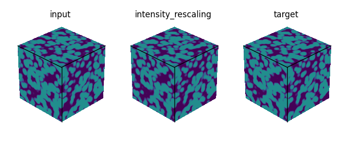
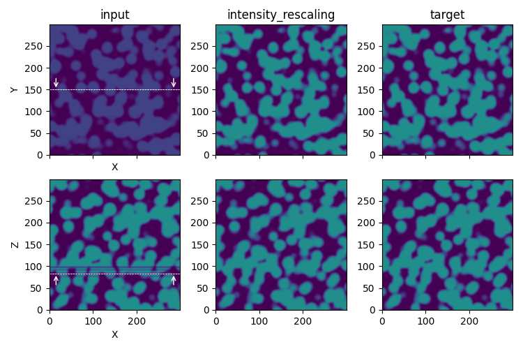
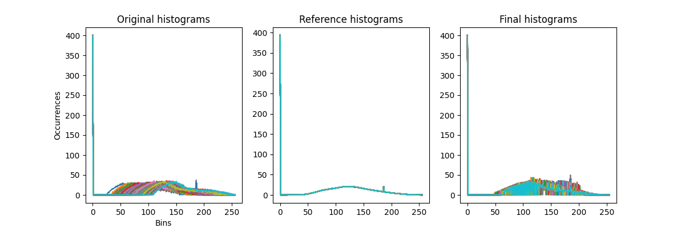
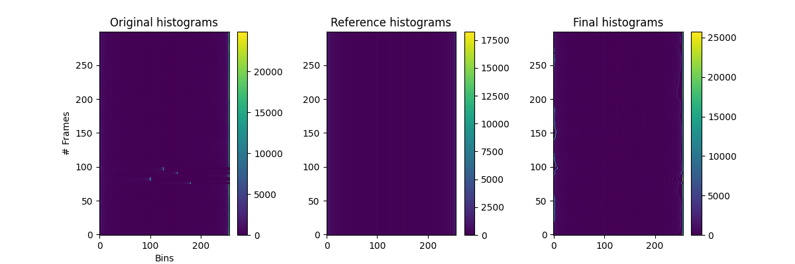

Intensity rescaling
===================

The **intensity rescaling** process aims at homogenizing the gray level histograms between consecutive images.
For stacks with areas of same material along the z-axis a dedicated process named **intensity_rescaling_area** can be used (see below).

To achieve this, a reference histogram is defined, corresponding either to the average histogram across all slices or to a running average along the slices (z-axis).

    Illustration of the **intensity_rescaling** process step in the `synthetic test case <https://github.com/CEA-MetroCarac/pystack3d/blob/main/examples/ex_synthetic_stack.py>`_. The Z cut-plane (taken at Z=83) corresponds to a slice with a strong change in contrast.

::

    [intensity_rescaling]
    nbins = 256
    #range_bins = [0, 127]
    filter_size = -1

``nbins`` corresponds to the number of bins associated to the histograms.

``range_bins`` defines the range of the gray values to be considered for the binning.
If this parameter is not specified, then a preliminary loop on all the slices are performed to determine the **min** and **max** values associated to the full stack, leading to **range_bins = [min, max]**.

``filter_size`` is related to the running averaging for determining the reference histograms.
A positive integer value is associated to the number of slices/frames to consider in the running average.
``filter_size = -1`` corresponds to an averaging performed across all slices.

.. note::

    In the case of areas with the same material along the z-axis (thus assumed to have a uniform gray level), a dedicated process named **intensity_rescaling_area** can be called.

    ::

        [intensity_rescaling_area]
        area = [0, 99999, 0, 99999]
        threshold_min = 0
        threshold_max = 99999
        factors_range = [0.8, 1.2]

    ``area`` refers to the [xmin, xmax, ymin, ymax] image coordinates to be selected (in pixel, according to the standard coordinates system with the origin located in the bottom left). ``threshold_min`` and ``threshold_max`` are used to define the range of values to work with and ``factors_range`` to bound the rescaling factor applied to the image values.

    The related plotting associated with **intensity_rescaling_area** corresponds to the gray levels means in the selected area (**means.png**) and the calculated rescaling factors (**factors.png**)

Plotting
--------

The special plotting related to the **intensity_rescaling** process step generates images in the dedicated **outputs**  folder that are named **intensity_rescaling_profiles.png** and **intensity_rescaling_maps.png**.

    **intensity_rescaling_profiles.png** gives the histograms profiles calculated for each slice.

    **intensity_rescaling_maps.png** returns the same information but according to intensity maps along the z-axis.

Note that in the map representation the maximal intensity values of the 2D-histograms are mainly hidden by the y-axis (except for slices in [70-100] of the Original histograms).