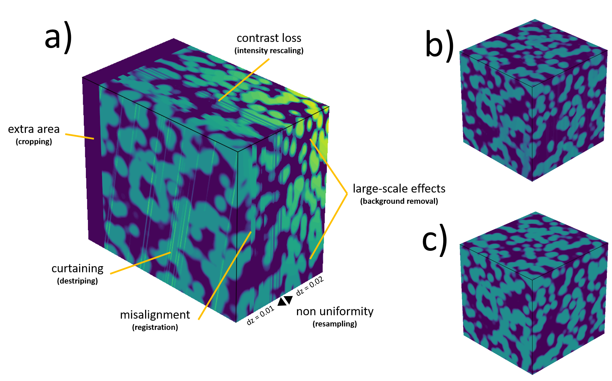
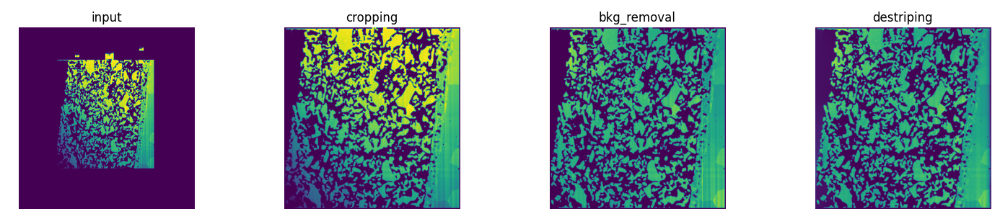

Introduction
============

What is PyStack3D ?
-------------------

PyStack3D is an open source library written in Python which provides tools to do
images stacks corrections, typically before image segmentation for images issued from 3D FIB-SEM acquisition.

The ``pystack3d`` workflow can be applied to multiple channels (image stacks corresponding to multiple detectors) and consists in the following optional process steps that can be executed in any order:

- ``cropping`` to reduce the image field of view to a ROI (Region Of Interest)

- ``background removal`` to reduce, based on polynomial approximations, contrast/brightness inhomogeneties resulting for instance from shadowing, charging, ...

- ``intensity rescaling`` to homogenize the 'gray' intensity distribution between successive frames/slices

- ``registration`` to correct the images misalignment due to shifting, drift, rotation, ... during the images acquisition

- ``destriping`` to minimize artefacts like stripes, that can appear in some image acquisition technics (typically in FIB-SEM)

- ``resampling`` to correct non uniform spatial steps between slices

- ``cropping_final`` to eliminate artefacts produced near the edges during the image processing, or to select another ROI at the end.

    Synthetic case illustrating a) the defects to be removed, b) the corrected stack by **PyStack3D**, c) the ground truth.

    Illustration of a FIB-SEM image correction using some of the **PyStack3D** process steps.

Performance
-----------

``PyStack3D`` was designed to perform rapid stack corrections using **multiprocessing**.

Here is an example of processing times associated with the example provided `here <https://github.com/CEA-MetroCarac/pystack3d/blob/main/examples/ex_real_stack_perf.py>`_, corresponding to a stack of **2000 images**, sized 4224 x 4224 before cropping and 2000 x 2000 after cropping, using **32 CPUs** (Intel(R) Xeon(R) Platinum 8362 CPU @ 2.80GHz) on a Linux server.

.. list-table:: Performance
   :widths: 25 10
   :header-rows: 1
   :align: center

   * - Process
     - Time (s)
   * - cropping
     - 30
   * - bkg_removal
     - 40
   * - destriping
     - 480*
   * - registration**
     - 24
   * - intensity_rescaling
     - 24
   * - resampling
     - 11

(*) **destriping** calculation performed on a GPU Nvidia A-100, with images processed one by one.

(**) **registration_calculation** and **registration_transformation** cumulative time

Install
-------
::

    pip install pystack3d

.. note::

    Note that to be executed with GPU, the **pyvsnr** library used by the **destriping** process requires a specific installation. Refer to the **pyvsnr** `requirements section <https://github.com/CEA-MetroCarac/pyvsnr?tab=readme-ov-file#requirements>`_ for further details.

Tests and examples execution
----------------------------

For tests and examples execution, the full ``pystack3d`` project has to be installed via ``git``::

    git clone https://github.com/CEA-MetroCarac/pystack3d.git
    cd [path_to_your_pystack3d_project]

Once the project has been cloned, the python environment has to be created and completed with the ``pytest`` package (for testing)::

    pip install poetry
    poetry install
    pip install pytest

Then the tests and the examples can be executed as follows::

    pytest
    cd examples
    python ex_synthetic_stack.py
    python ex_real_stack.py

Acknowledgements
----------------

This work, carried out on the CEA - Platform for Nanocharacterisation (PFNC), was supported by the “Recherche Technologique de Base” program of the French National Research Agency (ANR).

Citations
---------

In case you use the results of this code in an article, please cite:

- Quéméré P., David T. (2024). PyStack3D: A Python package for fast image stack correction. *Journal of Open Source Software. (submitted)*

additional citations for the **destriping**:

- Pavy K.,  Quéméré P. (2024). Pyvsnr 2.0.0. Zenodo. https://doi.org/10.5281/zenodo.10623640

- Fehrenbach J., Weiss P., Lorenzo C. (2012). Variational algorithms to remove stationary noise: applications to microscopy imaging. *IEEE Transactions on Image Processing 21.10 (2012): 4420-4430.*

additional citation for the **registration**:

- Thévenaz P., Ruttimann U.E., Unser M. (1998), A Pyramid Approach to Subpixel Registration Based on Intensity, *IEEE Transactions on Image Processing, vol. 7, no. 1, pp. 27-41, January 1998*
