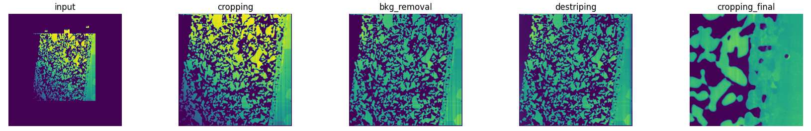

Introduction
============

What is PyStack3D ?
-------------------

PyStack3D is an open source library written in Python which provides tools to do
images stacks corrections, typically before image segmentation for images issued from FIB-SEM 3D acquisition.

The ``pystack3d`` workflow can be applied to multiple channels and consists in the following optional process steps that can be executed in any order:

- ``cropping`` to reduce the image field of view to a ROI (Region Of Interest)

- ``background removal`` to reduce from polynomial approximations artefacts issued for instance from shadowing, charging, ...

- ``intensity rescaling`` to homogenize the 'gray' intensity distribution between successive frames/slices

- ``registration`` to correct the images misalignment due to shifting, drift, rotation, ... during the images acquisition

- ``destriping`` to minimize artefacts like stripes that can appear in some image acquisition technics

- ``resampling`` to correct non uniform spatial steps

- ``cropping_final`` to eliminate artefacts produced near the edges during the image processing or to select another ROI at the end.

    Illustration of a FIB-SEM image correction using some of the **PyStack3D** process steps.

Install
-------

The ``pystack3d`` package install can be realized via a git cloning::

    git clone https://github.com/CEA-MetroCarac/pystack3d.git

or by a pypi install::

    pip install pystack3d

Tests and examples execution
----------------------------

::

    pip install pytest
    git clone https://github.com/CEA-MetroCarac/pystack3d.git
    cd pystack3d
    pytest
    python examples/ex_synthetic_stack.py
    python examples/ex_real_stack.py

Acknowledgements
----------------

This work, carried out on the CEA - Platform for Nanocharacterisation (PFNC), was supported by the “Recherche Technologique de Base” program of the French National Research Agency (ANR).

Citations
---------

In case you use the results of this code in an article, please cite:

- Quéméré P., David T. (2024). PyStack3D: A Python package for fast image stack correction. *Journal of Open Source Software. (submitted)*

additional citations for the **destriping**:

- Pavy K.,  Quéméré P. (2024). Pyvsnr 2.0.0. Zenodo. https://doi.org/10.5281/zenodo.10623640

- Fehrenbach J., Weiss P., Lorenzo C. (2012). Variational algorithms to remove stationary noise: applications to microscopy imaging. *IEEE Transactions on Image Processing 21.10 (2012): 4420-4430.*

additional citation for the **registration**:

- Thévenaz P., Ruttimann U.E., Unser M. (1998), A Pyramid Approach to Subpixel Registration Based on Intensity, *IEEE Transactions on Image Processing, vol. 7, no. 1, pp. 27-41, January 1998*
