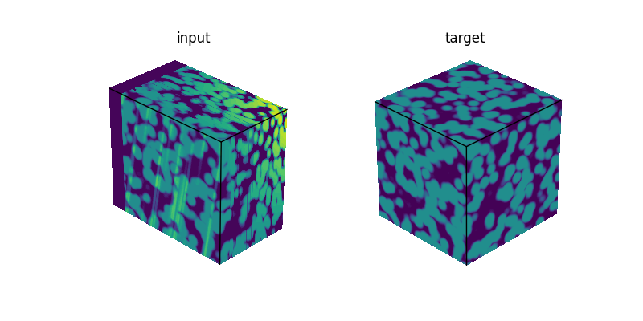
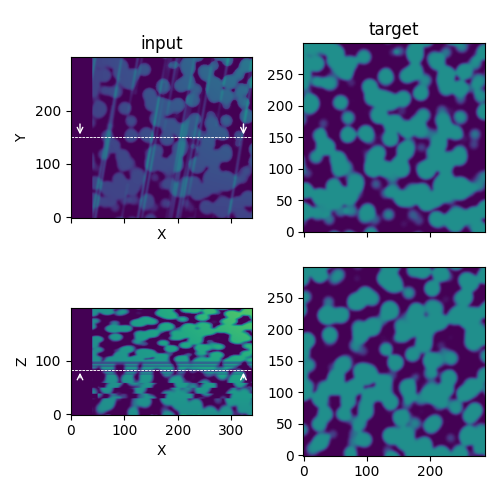

Parameters settings
===================

The PyStack3D workflow parameters are defined in a ``params.toml`` file that is structured as follows:

* The first parameters are related to the **general** parameters that specify the conditions of the **workflow** execution.

* The following 'encapsulated' parameters are related to the conditions of each **process step** execution.

To illustrate each of the process step we will consider hereafter the `synthetic test case <https://github.com/CEA-MetroCarac/pystack3d/blob/main/examples/ex_synthetic_stack.py>`_ associated to a original stack (named as 'target' by the next) composed of 300 x 300 x 300 voxels. The defects to be removed corresponds to:

    - curtaining effects in some slices

    - a background effects (defined from a polynom x*y*z),

    - shifts along the x-axis (for slices in [20-70])

    - changes in contrast (for slices in [70-100])

    - a non-uniform sampling (dz passing from 0.01 to 0.02 at slice 100)

    Illustration of the synthetic use case: 3D visualisations and cut-planes corresponding to Z=83 and Y=150.

.. toctree::
    :titlesonly:

    general.rst
    cropping.rst
    bkg_removal.rst
    intensity_rescaling.rst
    registration.rst
    destriping.rst
    resampling.rst
    cropping_final.rst