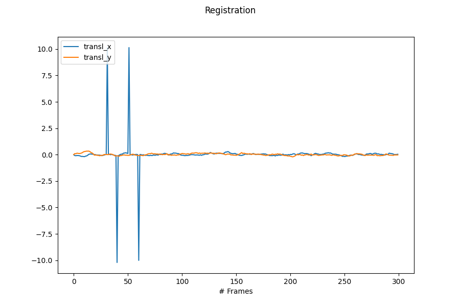

Registration
============

The registration process step consists of realigning the images with each other.

This process occurs in two steps.

* the **calculation** of the 3x3 (affine) transformation matrices associated to each pairs of consecutive images (based on the `pystackreg <https://pystackreg.readthedocs.io/en/latest/readme.html>`_ library).

* the **transformation** step as the application of the previous calculated matrices to the full stack.

.. figure:: _static/registration.png
    :width: 400px
    :align: center

    Illustration of the **registration** process step in the `synthetic test case <https://github.com/CEA-MetroCarac/pystack3d/blob/main/examples/ex_synthetic_stack.py>`_.

::

    [registration_calculation]
    #area = [5, 35, 5, 35]
    threshold = 0.5
    nb_blocks = [1, 1]
    transformation = "TRANSLATION"

    [registration_transformation]
    #constant_drift = [-0.3, 1.2]
    #box_size_averaging = 100
    mode = "edge"
    #cropping = false

``area`` is an **optional** keyword used to calculate the transformation matrices with cropped images in the aim to reduce the CPU time.
Note that the area should be sufficiently large to encompass "features" relevant for the registration processing.

``threshold`` is employed to binarize the images during the registration_calculation processing.

``nb_blocks`` allows decomposing the image into patches (according to a grid defined by the number of blocks in the x and y directions). This spatial division of the images thus enables accounting for non-uniform alignment effects on very large images that could not be captured by a single transformation matrix.

``transformation`` sets the type of the transformation to be considered (to choose among 'TRANSLATION', 'RIGID_BODY', 'SCALED_ROTATION', 'AFFINE', 'BILINEAR'). See the `pystackreg <https://pystackreg.readthedocs.io/en/latest/readme.html>`_ documentation for more details.

During the image acquisition, it is not uncommon for drift to occur (visible in the 'cumulative' transformation matrix resulting from the calculation step). ``constant_drift`` allows the user to remove the effect of a **constant** drift between each slide according to the values defined for each of the x and y directions.

In the case of a large-scale fluctuating drift, the user has the possibility to subtract the resulting mean component from a running average of a size (number of slices) defined by the ``box_size_averaging`` parameter.

``mode`` is associated to the extrapolation method to be considered when applying the transformation matrices (to choose among 'constant', 'edge', 'symmetric', 'reflect', 'wrap' - see `numpy.pad <https://numpy.org/doc/stable/reference/generated/numpy.pad.html>`_ for more details. Note that if 'constant' is selected, the corresponding value (cval) associated to the extrapolation is by default NaN (np.nan)).

``cropping`` is an activation key to perform cropping on the entire stack according to the area of aligned images preserved from any extrapolation effects.(Default value is ``false``).

Plotting
--------

The special plotting related to the **registration_calculation** and the **registration_transformation** process steps generates images in the dedicated **outputs**  folder that are named **registration_calculation.png** and **registration_calculation_cumul.png**.

    **registration_calculation.png** shows the transformation matrices values resulting from the registration of images pairs.

    **registration_calculation_cumul.png** shows the corresponding cumulative transformation used for the full stack images realignment.

