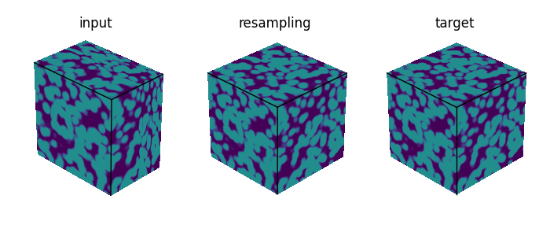
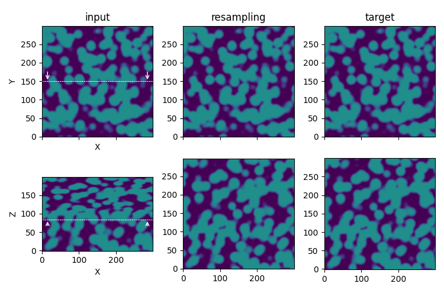
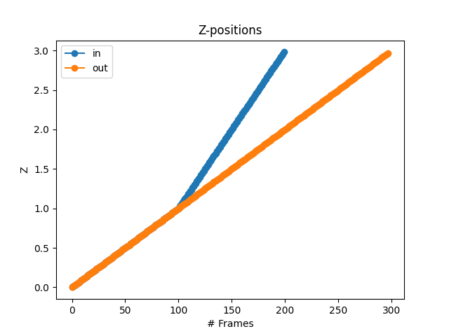

Resampling
==========

The resampling process step recreates slices with an uniform distribution (= with a constant step size along the z-axis), using linear interpolations between slices. For this, the **actual** position of the slices have to be known (for instance measured during the acquisition).

    Illustration of the **resampling** process step in the `synthetic test case <https://github.com/CEA-MetroCarac/pystack3d/blob/main/examples/ex_synthetic_stack.py>`_.

::

    [resampling]
    policy = "slice_{slice_nb}_z={z_coord}um.tif"
    dz = 0.01

``policy`` refers to the format of file names including the number of the slice (**slice_nb**) and its z coordinates (**z_coord**).

``dz`` corresponds to the step size along the z-axis to be considered in the resampling.

Plotting
--------

The special plotting related to the **resampling** process step generates images in the dedicated **outputs**  folder that are named **z_positions.png** and **z_increments.png**.

    **z_positions.png** shows the slices positions before (**in**) and after (**out**) the resampling.

.. figure:: _static/resampling_increments.png
    :width: 70%
    :align: center

    **z_increments.png** shows the slices z-increments before (**in**) and after (**out**) the resampling.
