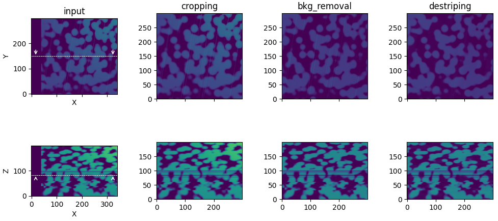
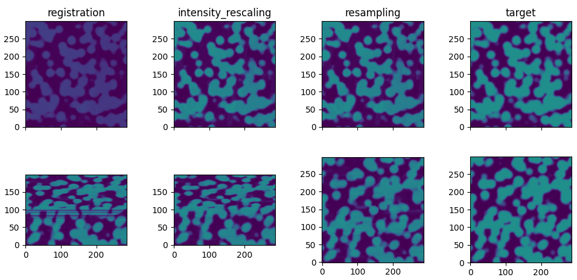

# Summary

Three-dimensional reconstruction from 2D image stacks is a crucial technique in various scientific domains. For instance, acquisition techniques like Focused Ion Beam Scanning Electron Microscopy (FIB-SEM) leverage this approach to visualize complex structures at the nanoscale. However, creating a "clean" 3D stack often requires image corrections to remove artifacts and inconsistencies, particularly for volume segmentation, a crucial process for 3D quantitative data analysis.

Here we present ``PyStack3D`` (\autoref{fig:PyStack3D}), a Python open-source library, that aimed at performing several image ‘cleaning’ tasks in the most integrated and efficient manner possible.

{width=85%}

# Statement of need

Accurate 3D reconstruction is crucial for extracting detailed features across various imaging techniques.
In life sciences, for instance, this includes identifying cellular organelles, understanding tissue architecture, and studying protein localization.
In energy materials, precise imaging is necessary for analyzing porous structures, mapping catalyst particles, and assessing battery electrode interfaces.
Various imaging methods, such as confocal microscopy, light sheet microscopy, and electron tomography, often introduce distortions or misalignments due to factors like optical aberrations, sample movement, and inconsistent illumination.
These issues become even more pronounced with FIB-SEM [@Hoflich], where artifacts from the milling process and variations in sample preparation can further complicate the 3D stack.
Effective correction of these distortions is essential for reliable segmentation and accurate feature extraction [@Osenberg].

# Statement of field

Certainly, one of the most widely used open-source software for performing image stack corrections is the Fiji software [@Fiji], a distribution of ImageJ. Written in Java, this software offers numerous macros for the analysis and processing of 2D and 3D images. Unfortunately, most of these macros do not support multiprocessing, resulting in processing times that can span hours for stacks composed of several thousand images.

As an alternative, ``PyStack3D`` like other codes [@Kreinin], [@Napari] have been developed or are currently under development these last years to achieve processing times of just a few minutes thanks to multiprocessing capabilities (see [Appendix](#appendix)).
This is intended to allow users to easily stop a workflow, adjust the parameters, and restart it if necessary.

# Implementation

In ``PyStack3D``, to reduce the memory footprint, slices are loaded and processed one by one either on a single processor or across multiple processors, depending on the user's machine capabilities.

A ``PyStack3D`` processing consists of a workflow made up of multiple processing steps, specified in a ``.toml`` parameter file, which can be executed in the order desired by the user.

The processing steps currently offered by ``PyStack3D`` are:

* **cropping** to reduce the image field of view to the users ROI (Region Of Interest)

* **background removal** to reduce, from polynomial approximations, large-scaled brightness and contrast variations issued for instance from shadowing or charging effects in FIB-SEM images acquisition

* **intensity rescaling** to homogenize the ‘gray’ intensity distribution between successive slices

* **registration** to correct the images misalignment due to shifting, drift, rotation, … during the images acquisition (based on the ``PyStackReg`` package [@PyStackReg])

* **destriping** to minimize artefacts like stripes or curtains effects typicaly found in FIB-SEM images (based on the ``PyVSNR`` package [@pyVSNR], [@VSNR])

* **resampling** to correct non uniform spatial inter-slice distances and enable correct 3D volume reconstructions

* **final cropping** to eliminate artefacts potentially produced near the edges during the image processing or to select another ROI at the end.

At the end of each process step, statistical profiles are automatically generated (showing the evolution of minimum, maximum, and mean values for each slice), along with relevant visualizations specific to the processing performed. In addition, a 3D and 2D rendering (cut-planes) akin to those shown in (\autoref{fig:PyStack3D}) and (\autoref{fig:workflow}) respectively can be produced.

Note that the processing can be carried out on multiple channels corresponding to images issued from multiple detectors, typically useful in the context of FIB-SEM input data. Moreover, when working with a Zeiss microscope, some metadata issued from the equipment can be automatically incorporated in the input ``.toml`` parameter file.

In conclusion, ``Pystak3D`` has been designed to evolve over time and accommodate new process steps. Its code structure has been crafted to seamlessly integrate new functionalities, leveraging multiprocessing capabilities.

# Acknowledgements

This work, carried out on the CEA-Platform for Nanocharacterisation (PFNC), was supported by the “Recherche Technologique de Base” program of the French National Research Agency (ANR).

\newpage

# Appendix

**Processing time for a stack composed of 2000 slices** (from [ex_real_stack_perf.py](https://github.com/CEA-MetroCarac/pystack3d/blob/main/examples/ex_real_stack_perf.py))

| Process step        | Time (s) |
|:--------------------|:--------:|
| cropping            |    30    |
| bkg_removal         |    40    |
| destriping          |   700*   |
| registration        |    24    |
| intensity_rescaling |    24    |
| resampling          |    11    |

**image size**: 4224 x 4224 before cropping / 2000 x 2000 after cropping.

**Machine**: Linux - **32 CPUs** Intel(R) Xeon(R) Platinum 8362 CPU @ 2.80GHz.

(*) 120s with a GPU Nvidia A-100.

# References
