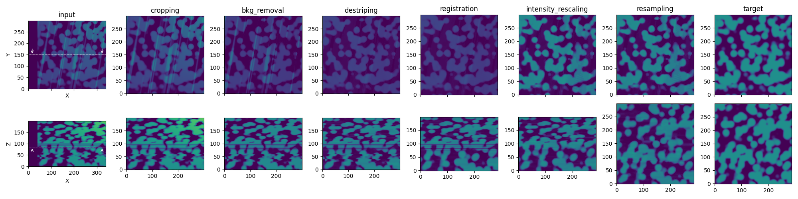

# Summary

**``PyStack3D``**: A Python package for fast image stack correction

Three-dimensional reconstruction from 2D image stacks is a crucial technique in various scientific domains. For instance, technics such as focused ion beam scanning electron microscopy (FIB-SEM) or time-of-flight secondary ion mass spectrometry (TOF-SIMS) leverage this approach to visualize complex structures at the nanoscale or analyze the distribution of chemical compounds with unprecedented precision. However, creating a "clean" 3D stack often requires image corrections to remove artifacts and inconsistencies, particularly for volume segmentation, a crucial process for 3D quantitative data analysis.

Here we present PyStack3D (\autoref{fig:PyStack3D}), a Python open-source library, that aimed at performing several image ‘cleaning’ tasks in the most integrated and efficient manner possible.

# Statement of need

Certainly, one of the most widely used open-source software for performing image stack corrections is the Fiji software [@Fiji] (a distribution of ImageJ). Written in Java, this software offers numerous features (macros) for the analysis and processing of 2D and 3D images. Unfortunately, most of these macros do not support multiprocessing, resulting in processing times that can span several hours for the thousands of images commonly encountered in stacks acquired by FIB-SEM.

In addition to being a tool that can be easily used into a workflow using Python scripting, ``PyStack3D`` has been developed to achieve processing times of just a few minutes through its full-multiprocessing capabilities and ease process steps stopping, restarting and replaying as an integrated suite software.

The components currently offered by ``PyStack3D`` are:

* A **cropping** process step to reduce the image field of view to the users ROI (Region Of Interest)

* A **background removal** process step to reduce, from polynomial approximations, large-scaled artefacts issued for instance from shadowing or charging effects in FIB-SEM images acquisition

* An **intensity rescaling** process step to homogenize the ‘gray’ intensity distribution between successive slices

* A **registration** process step to correct the images misalignment due to shifting, drift, rotation, … during the images acquisition (based on the ``PyStackReg`` package [@PyStackReg])

* A **destriping** process step to minimize artefacts like stripes or curtains effects that can appear in some image acquisition technics (based on the ``PyVSNR`` package [@pyVSNR], [@VSNR])

* A **resampling** process steps to correct non uniform spatial steps and enable correct 3D volume reconstructions

* A **final cropping** process step to select another ROI at the end and/or to eliminate artefacts produced near the edges during the image processing.

Based on a .toml parameter file, each of these treatments are performed one after the other, according to the user's desired order (\autoref{fig:workflow}).

Note that in the context of FIB-SEM data, the processing can be carried out by considering multiple channels and incorporating metadata from the equipment (FIBICS metadata).

To conclude, PyStack3D has been designed in the aim to add new processing components easily benefiting from the multithreading capabilities.

# Acknowledgements

This work, carried out on the CEA - Platform for Nanocharacterisation (PFNC), was supported by the “Recherche Technologique de Base” program of the French National Research Agency (ANR).

# References