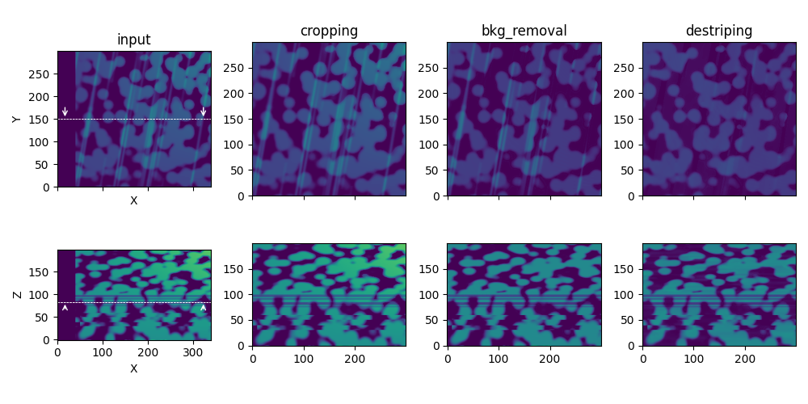

# Summary

Three-dimensional reconstruction from 2D image stacks is a crucial technique in various scientific domains. For instance, acquisition techniques like Focused Ion Beam Scanning Electron Microscopy (FIB-SEM) leverage this approach to visualize complex structures at the nanoscale. However, creating a "clean" 3D stack often requires image corrections to remove artifacts and inconsistencies, particularly for volume segmentation, a crucial process for 3D quantitative data analysis.

Here we present ``PyStack3D`` (\autoref{fig:PyStack3D}), a Python open-source library, that aims at performing several image ‘cleaning’ tasks in the most integrated and efficient manner possible.

{width=85%}

# Statement of need

Accurate 3D reconstruction is crucial for extracting detailed features across various imaging techniques.
In **life sciences**, for instance, this includes identifying cellular organelles, understanding tissue architecture or studying protein localization.
In **energy materials**, precise imaging is necessary for analyzing porous structures, mapping catalyst particles or assessing battery electrode interfaces.
Various imaging methods, such as confocal microscopy, light sheet microscopy, and electron tomography, often introduce distortions or misalignments due to factors like optical aberrations, sample movement or inconsistent illumination.
These issues become even more pronounced with FIB-SEM [@Hoflich], where artifacts from the milling process and variations in sample preparation can further complicate the 3D stack.

Effective correction of these distortions is essential for reliable segmentation and accurate feature extraction [@Osenberg; @SPEHNER].

# Statement of field

Certainly, one of the most widely used open-source software for performing image stack corrections is the Fiji software [@Fiji], a distribution of ImageJ [@ImageJ]. Written in **Java**, this software offers numerous macros for the analysis and processing of 2D and 3D images. Unfortunately, not all the macros needed to perform the stack corrections exist, and the existing macros do not all support multiprocessing, which can lead to processing times of several hours for stacks composed of thousands of images (see [Appendix](#appendix)).

As an alternative, codes written in **Python** like ``Hifiem`` [@Kreinin], ``PolishEM`` [@polishEM] or ``Napari`` [@Napari] have been developed in recent years to achieve processing times of just a few minutes thanks to multiprocessing capabilities. ``PyStack3D``, whose project started in 2020, is part of this trend. Designed to be executed as a workflow, ``PyStack3D`` aims to enable users to easily manage the automation of such workflows. With the quickly obtained results, users can easily readjust the parameters, and restart the processing if needed.

# Implementation

In ``PyStack3D``, to reduce the memory footprint, images (called "slices") are loaded and processed one by one either on a single processor or across multiple processors, depending on the user's machine capabilities.

The ``PyStack3D`` workflow is made up of multiple processing steps, specified in a ``.toml`` parameter file, and executed in the order desired by the user.

The processing steps currently offered by ``PyStack3D`` are:

* **cropping** to reduce the image field of view to the user's ROI (Region Of Interest)

* **background removal** to reduce, from 2D or 3D polynomial approximations, large-scaled brightness and contrast variations issued for instance from shadowing or charging effects in FIB-SEM images acquisition

* **intensity rescaling** to homogenize the ‘gray’ intensity distribution between successive slices and smooth out abrupt intensity jumps that can occur due to, for instance, variations in the beam source.

* **registration** to correct the image misalignment due to shifting, drift, rotation, … during the image acquisition [based on the ``PyStackReg`` package, @PyStackReg]

* **destriping** to minimize artefacts like stripes or curtain effects typically found in FIB-SEM images, based on the ``PyVSNR`` package [@pyVSNR;@VSNR], or wavelet decomposition [@Munch]

* **resampling** to correct non-uniform spatial inter-slice distances and enable correct 3D volume reconstructions

* **final cropping** to eliminate artefacts potentially produced near the edges during the image processing or to select another ROI at the end.

At the end of each process step, ``PyStack3D`` provides statistical profiles like evolution of minimum, maximum, and mean values for each slice, and relevant visualizations specific to the processing performed. In addition, 3D and 2D plots (cut-planes) akin to those shown in \autoref{fig:PyStack3D} and \autoref{fig:workflow}, respectively, can be produced.

Note that the processing can be carried out on multiple channels corresponding to images issued from multiple detectors, typically useful in the context of FIB-SEM input data. Moreover, when working with a Zeiss microscope, some metadata issued from the equipment can be automatically incorporated in the input ``.toml`` parameter file.

In conclusion, ``Pystack3D`` has been designed to evolve over time and accommodate new process steps. Its code structure has been crafted to seamlessly integrate new functionalities, leveraging multiprocessing capabilities.

# Acknowledgements

This work, carried out on the CEA-Platform for Nanocharacterisation (PFNC), was supported by the ``Recherche Technologique de Base'' program of the French National Research Agency (ANR).

\newpage

# Appendix

**Processing time for a stack composed of 2000 slices** (from [ex_real_stack_perf.py](https://github.com/CEA-MetroCarac/pystack3d/blob/main/examples/ex_real_stack_perf.py))

| Process step          | Fiji (s) | PyStack3D (s) | 
|:----------------------|:--------:|:-------------:|
| cropping              |   750    |      30       |  
| bkg_removal (2D / 3D) | 250 / -  |   70 / 40*    | 
| destriping            |  22400   |    700**      |  
| registration          |   5400   |      25       |   
| intensity_rescaling   |    -     |      25       |   
| resampling            |    -     |      10       |    

**image size**: 4224 x 4224 before cropping / 2000 x 2000 after cropping.

**Machine**: Linux - **32 CPUs** Intel(R) Xeon(R) Platinum 8362 CPU @ 2.80GHz.

(*) in 3D the polynomial coefficients are calculated only once, unlike in 2D, where the coefficients are recalculated for each slice.

(**) 120s with a GPU Nvidia A-100.

# References
