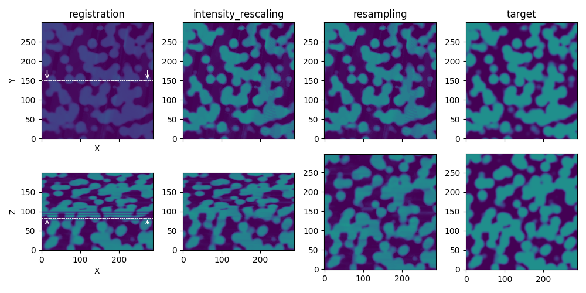

# Summary

Three-dimensional reconstruction from 2D image stacks is a crucial technique in various scientific domains. For instance, acquisition technic like focused ion beam scanning electron microscopy (FIB-SEM) leverage this approach to visualize complex structures at the nanoscale. However, creating a "clean" 3D stack often requires image corrections to remove artifacts and inconsistencies, particularly for volume segmentation, a crucial process for 3D quantitative data analysis.

Here we present ``PyStack3D`` (\autoref{fig:PyStack3D}), a Python open-source library, that aimed at performing several image ‘cleaning’ tasks in the most integrated and efficient manner possible.

{width=85%}

# Statement of need

Certainly, one of the most widely used open-source software for performing image stack corrections is the Fiji software [@Fiji], a distribution of ImageJ. Written in Java, this software offers numerous macros for the analysis and processing of 2D and 3D images. Unfortunately, most of these macros do not support multiprocessing, resulting in processing times that can span hours for stacks composed of several thousand images.

As an alternative, ``PyStack3D`` has been developed to achieve processing times of just a few minutes through its full multiprocessing capabilities (see [Appendix](#appendix)), enabling easy workflow stopping, readjusting and restarting. In addition, slices are loaded and processed one by one, reducing the memory footprint even in the case of very large datasets. At last, it is a tool that can be easily used into a workflow using Python scripting.

The workflow components currently offered by ``PyStack3D`` are:

* **cropping** to reduce the image field of view to the users ROI (Region Of Interest)

* **background removal** to reduce, from polynomial approximations, large-scaled brightness and contrast variations issued for instance from shadowing or charging effects in FIB-SEM images acquisition

* **intensity rescaling** to homogenize the ‘gray’ intensity distribution between successive slices

* **registration** to correct the images misalignment due to shifting, drift, rotation, … during the images acquisition (based on the ``PyStackReg`` package [@PyStackReg])

* **destriping** to minimize artefacts like stripes or curtains effects typicaly found in FIB-SEM images (based on the ``PyVSNR`` package [@pyVSNR], [@VSNR])

* **resampling** to correct non uniform spatial inter-slice distances and enable correct 3D volume reconstructions

* **final cropping** to eliminate artefacts potentially produced near the edges during the image processing or to select another ROI at the end.

Based on a ``.toml`` parameter file, these processing steps can be executed according to the user's desired order.

At the end of each process step, statistical profiles are automatically generated (showing the evolution of minimum, maximum, and mean gray values for each slice), along with relevant visualizations specific to the processing performed. In addition, a 3D and 2D rendering (cut-planes) akin to those shown in (\autoref{fig:PyStack3D}) and (\autoref{fig:workflow}) respectively can be produced.

Note that the processing can be carried out on multiple channels corresponding to images from multiple detectors, typically useful in the context of FIB-SEM input data, and some metadata issued from the equipment can be automatically incorporated when working with a Zeiss microscope.

In conclusion, ``Pystak3D`` has been designed to evolve over time and accommodate new process steps. Its code structure has been crafted to seamlessly integrate new functionalities, leveraging multiprocessing capabilities.

# Acknowledgements

This work, carried out on the CEA-Platform for Nanocharacterisation (PFNC), was supported by the “Recherche Technologique de Base” program of the French National Research Agency (ANR).

# Appendix

**Processing time for a stack composed of 2000 slices** (from [ex_real_stack_perf.py](https://github.com/CEA-MetroCarac/pystack3d/blob/main/examples/ex_real_stack_perf.py))

| Process step        | Time (s) |
|:--------------------|:--------:|
| cropping            |    30    |
| bkg_removal         |    40    |
| destriping          |   480*   |
| registration**      |    24    |
| intensity_rescaling |    24    |
| resampling          |    11    |

**image size**: 4224 x 4224 before cropping / 2000 x 2000 after cropping.

**Machine**: Linux - **32 CPUs** Intel(R) Xeon(R) Platinum 8362 CPU @ 2.80GHz.

(*) **destriping** calculation performed on a GPU Nvidia A-100 with images processed one by one.

(**) **registration_calculation** and **registration_transformation** cumulative time

# References
