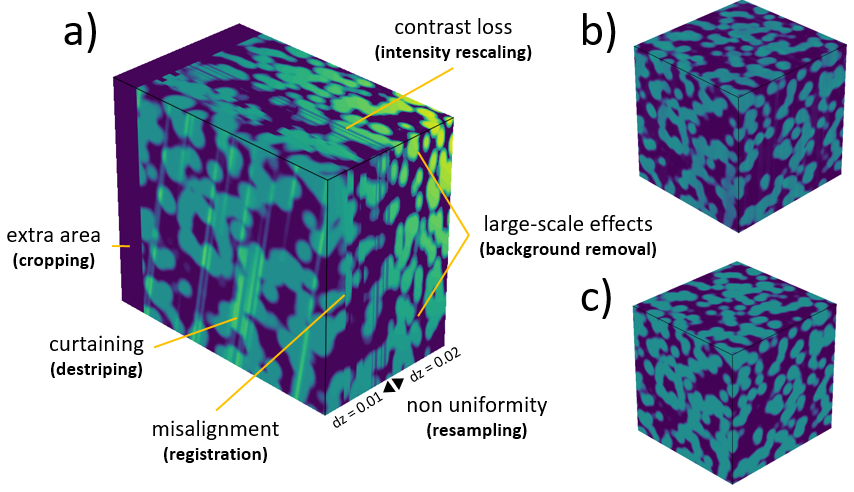

# Summary

Three-dimensional reconstruction from 2D image stacks is a crucial technique in various scientific domains. For instance, technics such as focused ion beam scanning electron microscopy (FIB-SEM) or time-of-flight secondary ion mass spectrometry (TOF-SIMS) leverage this approach to visualize complex structures at the nanoscale or analyze the distribution of chemical compounds with unprecedented precision. However, creating a "clean" 3D stack often requires image corrections to remove artifacts and inconsistencies, particularly for volume segmentation, a crucial process for 3D quantitative data analysis.

Here we present ``PyStack3D`` (\autoref{fig:PyStack3D}), a Python open-source library, that aimed at performing several image ‘cleaning’ tasks in the most integrated and efficient manner possible.

{width=85%}

# Statement of need

Certainly, one of the most widely used open-source software for performing image stack corrections is the Fiji software [@Fiji], a distribution of ImageJ. Written in Java, this software offers numerous macros for the analysis and processing of 2D and 3D images. Unfortunately, most of these macros do not support multiprocessing, resulting in processing times that can span hours for stacks composed of several thousand images.

In addition to being a tool that can be easily used into a workflow using Python scripting, ``PyStack3D`` has been developed to achieve processing times of just a few minutes through its full multiprocessing capabilities, enabling easy workflow stopping, readjusting and restarting.

The workflow components currently offered by ``PyStack3D`` are:

* **cropping** to reduce the image field of view to the users ROI (Region Of Interest)

* **background removal** to reduce, from polynomial approximations, large-scaled artefacts issued for instance from shadowing or charging effects in FIB-SEM images acquisition

* **intensity rescaling** to homogenize the ‘gray’ intensity distribution between successive slices

* **registration** to correct the images misalignment due to shifting, drift, rotation, … during the images acquisition (based on the ``PyStackReg`` package [@PyStackReg])

* **destriping** to minimize artefacts like stripes or curtains effects that can appear in some image acquisition technics (based on the ``PyVSNR`` package [@pyVSNR], [@VSNR])

* **resampling** to correct non uniform spatial steps from slice to slice and enable correct 3D volume reconstructions

* **final cropping** to select another ROI at the end and/or eliminate artefacts potentially produced near the edges during the image processing.

Based on a ``.toml`` parameter file, each of these treatments are performed according to the user's desired order.

At the end of each process step, statistical profiles are automatically generated (showing the evolution of minimum, maximum, and mean values for each slice), along with visualizations specific to the processing performed. In addition, a 3D and 2D rendering (cut-planes) akin to those shown in (\autoref{fig:PyStack3D}) and (\autoref{fig:workflow}) respectively can be produced.

Note that in the context of FIB-SEM input data, the processing can be carried out by considering multiple channels and incorporating some metadata issued from the equipment.

In conclusion, ``Pystak3D`` has been designed to evolve over time and accommodate new process steps. Its code structure has been crafted to seamlessly integrate new functionalities, leveraging multiprocessing capabilities.

# Acknowledgements

This work, carried out on the CEA-Platform for Nanocharacterisation (PFNC), was supported by the “Recherche Technologique de Base” program of the French National Research Agency (ANR).

# References